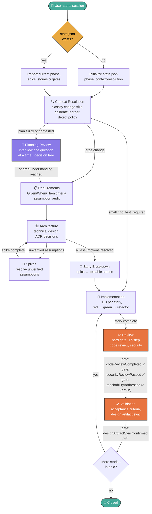

# Cadet-Agent

Cadet-Agent is an **opinionated** cross-IDE agent framework for game-development workflows. It is built on foundational software engineering practices and real-world game-development experience, with the goal of **guiding you through the entire development process** — from requirements and technical design through TDD, implementation, and review.

Cadet-Agent is **not a one-shot code generator**. It won't spit out a finished game from a single prompt. Instead, it walks you through each phase methodically: calibrating the learner model, scoping work into epics and stories, planning architecture, writing tests first, and iterating on feedback. The shared framework core integrates with GitHub Copilot, Cursor, Continue, Claude Code, and Deep Code.

## Repository Layout
- `.cadet/agent/core/` contains the shared Cadet-Agent framework documents.
  - `cadet-agent.md` is the thin global directive: identity, non-negotiable rules, workflow routing, hard-gate protocol, and skill dispatch.
  - `Harness.md` is the canonical harness contract: budgets, evidence-backed gates, retries, context tiers, tool routing, privacy, and escalation.
  - `harness.schema.json` and `state.schema.json` are the machine-readable schemas for harness records and session state.
  - `skills/` contains scoped workflow-phase skills (PlanningReview, Requirements, Architecture, Spike, StoryBreakdown, TDD, Debugging, CodeReview, Resume, MCPSetup, AgentReviewer).
  - `templates/` contains runtime templates for planning artifacts.
- `.cadet/harness.json` holds repository-local budget/policy overrides (preserved by sync).
- `.cadet/runs/` holds sanitized run ledgers (preserved by sync; no secrets or raw prompts by default).
- `src/harness/` contains the dependency-free harness implementation (policy, budget, state, verification, context, routing, redaction, ledger, archive, hook).
- `.cadet/agent/docs/` contains setup guides for each supported IDE.
- `.github/agents/` contains the Copilot custom agent definitions (Cadet Agent + Cadet Agent Reviewer).
- `.github/prompts/` contains Copilot slash-command skill prompts (`/cadet-review`, `/cadet-tdd`, etc.).
- `.cursor/` contains Cursor-specific authored files.
- `.continue/` contains Continue-specific authored files.
- `.claude/` contains Claude Code-specific authored files.
- `.agents/skills/` contains Deep Code (and cross-client) skill adapters.
- These IDE folders hold thin integration shims; the core framework logic still lives in `.cadet/agent/core/`.
- `package-agent.ps1` builds the distributable `cadet-agent.zip` package.
- `bump-version.ps1` bumps the version, updates version-bearing files, commits, tags, and pushes. It runs `npm run lint` first and refuses to release if the link check fails.
- `npm run lint` checks all markdown links (the same offline check CI runs); `npm run verify` runs tests + lint.

## Cross-IDE Support

Cadet-Agent provides full workflow parity across five IDEs. The same 10 skills + reviewer are available in each:

| Feature | GitHub Copilot | Cursor | Continue | Claude Code | Deep Code |
|---|---|---|---|---|---|
| Auto-load rules | Agent definition | `alwaysApply` rule | Project rule | Project skill | Project skill (`.agents/skills/`) |
| Skill dispatch | `/cadet-<skill>` prompts | Natural language | `/cadet-<skill>` commands | `/cadet-<skill>` skills | `/skills` menu (`/`) |
| Planning Review | ✅ | ✅ | ✅ | ✅ | ✅ |
| Requirements | ✅ | ✅ | ✅ | ✅ | ✅ |
| Architecture | ✅ | ✅ | ✅ | ✅ | ✅ |
| Spike | ✅ | ✅ | ✅ | ✅ | ✅ |
| Story Breakdown | ✅ | ✅ | ✅ | ✅ | ✅ |
| TDD | ✅ | ✅ | ✅ | ✅ | ✅ |
| Debugging | ✅ | ✅ | ✅ | ✅ | ✅ |
| Code Review | ✅ | ✅ | ✅ | ✅ | ✅ |
| Resume | ✅ | ✅ | ✅ | ✅ | ✅ |
| MCP Setup | ✅ | ✅ | ✅ | ✅ | ✅ |
| Reviewer mode | Agent picker | Rule toggle | `/cadet-agent-reviewer` | `/cadet-agent-reviewer` | `cadet-agent-reviewer` skill |
| Git guard | PreToolUse hook | Manual | Manual | Manual | `permissions.ask` (`mutate-git-log`) |

All adapters delegate to the canonical files under `.cadet/agent/core/` — no duplicated rules or skills. See `ADAPTERS.md` for the full inventory and `docs/guidance/DeepCode.md` for Deep Code setup.

## Quick Install

```bash
npx cadet-agent@latest init
```

This downloads the latest framework release and extracts it into your current directory. For a specific target directory:

```bash
npx cadet-agent@latest init --target ./my-unity-project
```

### Keeping the Framework Updated

```bash
npx cadet-agent@latest sync
```

When a new release is available, `sync` downloads the updated framework and replaces managed files (`.cadet/agent/core/`, IDE integration shims, agent definitions). Your local policies (`.cadet/agent/policies/`), project plans (`.cadet/agent/project-plans/`), harness overrides (`.cadet/harness.json`), and run ledgers (`.cadet/runs/`) are automatically preserved. After syncing, start a fresh chat for the changes to take effect.

To sync a specific directory:

```bash
npx cadet-agent@latest sync --target ./my-unity-project
```

#### AGENTS.md is create-only

Cadet ships a repository-root `AGENTS.md` (a thin pointer to `.cadet/agent/core/cadet-agent.md`). If your repo already has one, Cadet **never overwrites it**:

- In a terminal, `init`/`sync` ask whether to keep, overwrite, or merge (default: keep).
- Non-interactive installs (CI, `--yes`, piped output) always **keep** and print a tag-pinned link to Cadet's copy.
- Control it explicitly with `--agents-md keep|overwrite|merge`.
- `merge` inserts Cadet's text between `<!-- cadet-agent:begin -->` / `<!-- cadet-agent:end -->` markers and leaves the rest of your file untouched.

```bash
npx cadet-agent@latest sync --agents-md keep       # never touch an existing AGENTS.md
npx cadet-agent@latest sync --yes                  # non-interactive; keeps existing files
```

## Manual Install (fallback)

If you prefer to install from a packaged release artifact, download `cadet-agent.zip` from [GitHub Releases](https://github.com/naishtech/cadet-agent/releases) and extract it into your Unity project root:

```powershell
Expand-Archive .\cadet-agent.zip -DestinationPath . -Force
```

## Getting Started
- For framework navigation after install, see `.cadet/agent/core/README.md`.
- IDE setup guides and full documentation are at the [canonical repository](https://github.com/naishtech/cadet-agent) (GitHub Pages).

## Workflow

Cadet-Agent follows a structured SDLC with hard gates between phases. The workflow path adapts to change size: **large** changes go through the full pipeline, **small** changes skip planning artifacts, and **no_test_required** changes (docs, config) skip TDD.



### Resuming a Session

Use the `/cadet-resume` slash command to pick up where you left off. It reads `.cadet/state.json` and reports the current phase, epic/story progress, and outstanding gates — then dispatches the right skill for the next step. It also checks the current branch and working tree, so leftover changes from a previous task are resolved (commit, stash, push, or move to a new branch) before a new task begins. If no state file exists, it initializes a fresh session from `context-resolution`.

### Phase Gating

Hard gates are enforced at every phase transition. The agent reads `.cadet/state.json → gates` before advancing and **blocks** the transition if any required gate is `false`. Gates cannot be skipped without an explicit user-directed exception recorded in `changeHistory`.

| Transition | Required Gates |
|---|---|
| implementation → review | `testsPassed`, `compileCheckConfirmed`, `unityAnalyzerClean`, `storyTrackingUpdated` |
| review → validation | `codeReviewCompleted`, `securityReviewPassed`, `acceptanceCriteriaValidated`, and `reachabilityAddressed` when `reachability.enabled` is set |
| validation → closed | `designArtifactSyncConfirmed` |

**`closed` is end-of-epic, not per-story.** `validation → closed` is taken only when no stories remain (`NEXT_STORY → no → CLOSED` above). When an epic still has stories, the next story re-enters from `validation → implementation` (`NEXT_STORY → yes → IMPL`). Do not close a story individually: `closed` is terminal, and there is no transition out of it.

The full set of legal transitions is the three gated rows above **plus** the ungated forward edges (classification, planning progression, `story-breakdown → implementation`, and the `validation → implementation` next-story loop). Any transition outside that set is rejected with a named reason.

### Harness

Gates are backed by **evidence**, not assertion. Each claimed gate must have a fresh, non-superseded evidence record bound to the current work item, input tree hash, and acceptance criteria. The harness also bounds context, tokens, tool calls, retries, wall-clock time, cost, and archive sizes — and those bounds are enforced, not advisory.

- Rules: `.cadet/agent/core/Harness.md`. Data contract: `docs/core/HarnessContract.md`.
- Overrides: `.cadet/harness.json` (preserved by sync; conservative defaults in `src/harness/policy.mjs`).
- Ledgers: `.cadet/runs/<runId>.json` (sanitized; artifacts are redacted before they are written; no secrets or raw prompts by default).
- Transitions recompute the input tree hash from the evidence's relevant files, so editing a relevant file invalidates the evidence.
- `harness verify` binds evidence to `--files` (or the working tree's changed files), and a `testsPassed` green result requires a prior red record.
- When Git is unavailable and no `--files` are given, verification blocks (`freshness-unavailable`) rather than recording unscoped evidence.
- `state validate` rejects a `true` gate whose evidence is missing, stale, expired, superseded, or bound to another work item; evidence records are schema-validated in full (`command`, `result`, `criteriaHash`, and a freshness bound).
- Evidence must include a UUID, work item, phase, gate, status, command/result, input-tree hash, criteria hash, relevant files, timestamp, and either `expiresAt` or `freshnessPolicy`.
- **Evidence history does not live in `state.json`.** A v4 document keeps only the active work item's records inline; a closed work item's evidence is written into the commit that closes it, as `Cadet-*` trailers, and archived to `.cadet/archive/`. `evidenceCoverage` indexes what left, so the "a done story owns evidence" check still works offline. Cadet still never commits: `state seal` prepares a message file and you commit with `git commit -F`.
- Command output counts against the output budget; a configured cost budget cannot be satisfied by unmeasurable cost (the run is blocked, `budget-blocked`).
- State and run ledgers are written atomically, so an interrupted write cannot truncate a record; persisted artifacts are redacted before hashing or writing.
- Empty freshness coverage is an explicit policy decision: set `allowEmptyFreshness: true` in `.cadet/harness.json` only when unscoped evidence is acceptable.

```bash
cadet-agent state validate                       # validate state against the schema (read-only)
cadet-agent state validate --verify-sealed       # also read evidence out of commit trailers
cadet-agent state migrate                        # atomically upgrade v1 → the current version
cadet-agent state migrate --to 4                 # archive closed work items' evidence; build the index
cadet-agent state compact --keep active          # routine housekeeping on a v4 state
cadet-agent state seal                           # write the active work item's evidence as commit trailers
cadet-agent state transition --to review         # enforce the matrix + evidence
cadet-agent harness verify --gate testsPassed --files src/a.cs   # bounded, classified loop
cadet-agent harness report                       # budget consumption and failures (no secrets)
cadet-agent harness cleanup --older-than-ms <n>  # apply the retention policy (bound required)
cadet-agent harness capabilities                 # available CLI/Unity/MCP/hook/token/cost telemetry
```

Every command supports `--format human|json` and exits nonzero for invalid state, failed verification, budget exhaustion, stale evidence, or safety rejection.

Every command also **declares whether it writes**, and the declaration is enforced rather than
trusted. `--help` is read-only at any depth, `--dry-run` is honoured by every mutating command, and a
command declared read-only is tested to perform no writes. A destructive command that may run
unattended must require a content-bearing bound — `cleanup` requires `--older-than-ms` — so an agent
states *what* it acts on rather than merely *that* it approves. Run
`cadet-agent harness capabilities --format json` to read the registry.

Two refusals exist so an unattended agent cannot destroy evidence by accident:

```bash
cadet-agent harness cleanup                      # exits 1: deletes nothing without a bound
cadet-agent harness record --dry-run             # reports what it would write, writes nothing
```

See `docs/guidance/HarnessTroubleshooting.md` for stale evidence, budget exhaustion, unavailable Unity CLI, and live MCP connection failures.

## Examples

### GitHub Copilot
Run `npx cadet-agent@latest init` in your Unity project root, then open the repo in VS Code.

**Agent mode:** Select the **Cadet Agent** agent from the agent picker in Copilot Chat. The agent definition at `.github/agents/cadet.agent.md` loads the thin directive in `.cadet/agent/core/cadet-agent.md` and dispatches scoped skills.

```text
[Describe your game dev task...]
```

Cadet Agent will classify the change, check `.cadet/state.json` for blocking gates, and invoke the appropriate skill.

**Skill mode:** For a specific workflow phase, use the matching slash command so the skill becomes the primary instruction context:

```text
/cadet-planning-review
clarify the plan for a co-op loot system before I write the design
```

```text
/cadet-requirements
create a requirements doc for a kart handling prototype
```

```text
/cadet-review
review the PR at https://github.com/... or review story-1 in epic-1-player-movement
```

**Review mode:** After the Cadet Agent completes a task, select the **Cadet Agent Reviewer** from the agent picker. Provide the task, story, or PR to review:

```text
Review the PR at https://github.com/... or Review story-1 in epic-1-player-movement
```

The reviewer will read `.cadet/agent/core/cadet-agent.md` as the rulebook, audit `.cadet/state.json` for gate compliance, and check the code and artifacts against every non-negotiable rule. It produces a structured report with a gate audit, process deviations, and recommendations — it does not edit code.

### Cursor feature request
After opening the repository in Cursor, the always-apply rule in `.cursor/rules/cadet-agent.md` should load automatically. A typical request looks like this:

```text
Design a small vertical slice for a kart handling prototype in Unity. Start with requirements, then a technical design, then the first TDD task.
```

Cursor will use the Cadet rule to pull workflow, standards, and guidance from `.cadet/agent/core` before responding.

### Continue planning request
With Continue installed in VS Code, open the repository and ask for a scoped planning artifact:

```text
Create a requirements outline for a single-player time-trial mode with ghost replay support and Given/When/Then acceptance criteria.
```

The Continue rule in `.continue/rules/cadet-agent.md` should steer the response back through the shared Cadet framework.

### Deep Code request
With [Deep Code](https://deepcode.vegamo.cn/) installed (`npm install -g @vegamo/deepcode-cli`), run `deepcode` in the repository and use `/skills` to confirm the `cadet-*` skills are discovered from `.agents/skills/`. Then pick a phase skill from the `/` menu (there is no `/cadet-<skill>` command — select it by name, or ask for the phase in plain language):

```text
Run the TDD skill for the ghost-replay story.
```

Because Deep Code has no PreToolUse hook, enforce the commit/push approval gate in `.deepcode/settings.json`:

```json
{
  "permissions": {
    "ask": ["mutate-git-log", "network"],
    "defaultMode": "askAll"
  }
}
```

See `docs/guidance/DeepCode.md` for the full setup, MCP wiring, and configuration reference.

### Repository policy example
If a specific game repository needs local conventions, add a policy file under `.cadet/agent/policies` using `.cadet/agent/core/Templates/PolicyTemplate.md`. For example, a repository policy could define:
- where project plans should live
- where shared gameplay code should be extracted
- which Unity packages or UI stack are the project default

## Package Output
Running `./package-agent.ps1` produces `cadet-agent.zip` with this layout:
- `.cadet/agent/core/` (including `Harness.md`, `harness.schema.json`, and `state.schema.json`)
- `.cadet/agent/core/skills/`
- `.cadet/agent/core/templates/`
- `.github/agents/cadet.agent.md`
- `.github/agents/cadet-agent-reviewer.agent.md`
- `.github/prompts/cadet-*.prompt.md`
- `.github/hooks/`
- `.cursor/rules/cadet-agent.md`
- `.cursor/rules/cadet-agent-reviewer.md`
- `.continue/rules/cadet-agent.md`
- `.continue/rules/cadet-agent-reviewer.md`
- `.continue/config.yaml`
- `.claude/skills/cadet-agent/SKILL.md`
- `.claude/skills/cadet-*/SKILL.md`

## Notes
- `.cadet/agent/core/FrameworkManifest.json` defines the managed and preserved paths for packaged installs.
- Workflow progress is tracked in `.cadet/state.json` with two modes: **markdown** (epic/story files) or **GitHub** (Projects/Issues).
- Repository-specific policy overlays belong in `.cadet/agent/policies`.
- Planning artifacts belong in `.cadet/agent/project-plans` unless an active policy says otherwise.