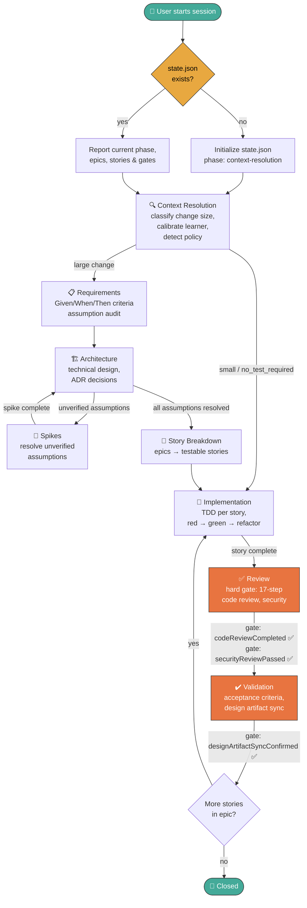

# Cadet-Agent

Cadet-Agent is an **opinionated** cross-IDE agent framework for game-development workflows. It is built on foundational software engineering practices and real-world game-development experience, with the goal of **guiding you through the entire development process** — from requirements and technical design through TDD, implementation, and review.

Cadet-Agent is **not a one-shot code generator**. It won't spit out a finished game from a single prompt. Instead, it walks you through each phase methodically: calibrating the learner model, scoping work into epics and stories, planning architecture, writing tests first, and iterating on feedback. The shared framework core integrates with GitHub Copilot, Cursor, Continue, and Claude Code.

## Repository Layout
- `.cadet/agent/core/` contains the shared Cadet-Agent framework documents.
  - `cadet-agent.md` is the thin global directive: identity, non-negotiable rules, workflow routing, hard-gate protocol, and skill dispatch.
  - `skills/` contains scoped workflow-phase skills (Requirements, Architecture, Spike, StoryBreakdown, TDD, Debugging, CodeReview, Resume, MCPSetup, AgentReviewer).
  - `templates/` contains runtime templates for planning artifacts.
- `.cadet/agent/docs/` contains setup guides for each supported IDE.
- `.github/agents/` contains the Copilot custom agent definitions (Cadet Agent + Cadet Agent Reviewer).
- `.github/prompts/` contains Copilot slash-command skill prompts (`/cadet-review`, `/cadet-tdd`, etc.).
- `.cursor/` contains Cursor-specific authored files.
- `.continue/` contains Continue-specific authored files.
- `.claude/` contains Claude Code-specific authored files.
- These IDE folders hold thin integration shims; the core framework logic still lives in `.cadet/agent/core/`.
- `package-agent.ps1` builds the distributable `cadet-agent.zip` package.
- `publish-npm.ps1` publishes the CLI to npm using a token from `~/.npm_token`.

## Cross-IDE Support

Cadet-Agent provides full workflow parity across four IDEs. The same 9 skills + reviewer are available in each:

| Feature | GitHub Copilot | Cursor | Continue | Claude Code |
|---|---|---|---|---|
| Auto-load rules | Agent definition | `alwaysApply` rule | Project rule | Project skill |
| Skill dispatch | `/cadet-<skill>` prompts | Natural language | `/cadet-<skill>` commands | `/cadet-<skill>` skills |
| Requirements | ✅ | ✅ | ✅ | ✅ |
| Architecture | ✅ | ✅ | ✅ | ✅ |
| Spike | ✅ | ✅ | ✅ | ✅ |
| Story Breakdown | ✅ | ✅ | ✅ | ✅ |
| TDD | ✅ | ✅ | ✅ | ✅ |
| Debugging | ✅ | ✅ | ✅ | ✅ |
| Code Review | ✅ | ✅ | ✅ | ✅ |
| Resume | ✅ | ✅ | ✅ | ✅ |
| MCP Setup | ✅ | ✅ | ✅ | ✅ |
| Reviewer mode | Agent picker | Rule toggle | `/cadet-agent-reviewer` | `/cadet-agent-reviewer` |
| Git guard | PreToolUse hook | Manual | Manual | Manual |

All adapters delegate to the canonical files under `.cadet/agent/core/` — no duplicated rules or skills. See `ADAPTERS.md` for the full inventory.

## Quick Install

```bash
npx cadet-agent@latest init
```

This downloads the latest framework release and extracts it into your current directory. For a specific target directory:

```bash
npx cadet-agent@latest init --target ./my-unity-project
```

### Keeping the Framework Updated

```bash
npx cadet-agent@latest sync
```

When a new release is available, `sync` downloads the updated framework and replaces managed files (`.cadet/agent/core/`, IDE integration shims, agent definitions). Your local policies (`.cadet/agent/policies/`) and project plans (`.cadet/agent/project-plans/`) are automatically preserved. After syncing, start a fresh chat for the changes to take effect.

To sync a specific directory:

```bash
npx cadet-agent@latest sync --target ./my-unity-project
```

## Manual Install (fallback)

If you prefer to install from a packaged release artifact, download `cadet-agent.zip` from [GitHub Releases](https://github.com/naishtech/cadet-agent/releases) and extract it into your Unity project root:

```powershell
Expand-Archive .\cadet-agent.zip -DestinationPath . -Force
```

## Getting Started
- For framework navigation after install, see `.cadet/agent/core/README.md`.
- IDE setup guides and full documentation are at the [canonical repository](https://github.com/naishtech/cadet-agent) (GitHub Pages).

## Workflow

Cadet-Agent follows a structured SDLC with hard gates between phases. The workflow path adapts to change size: **large** changes go through the full pipeline, **small** changes skip planning artifacts, and **no_test_required** changes (docs, config) skip TDD.



### Resuming a Session

Use the `/cadet-resume` slash command to pick up where you left off. It reads `.cadet/state.json` and reports the current phase, epic/story progress, and outstanding gates — then dispatches the right skill for the next step. It also checks the current branch and working tree, so leftover changes from a previous task are resolved (commit, stash, push, or move to a new branch) before a new task begins. If no state file exists, it initializes a fresh session from `context-resolution`.

### Phase Gating

Hard gates are enforced at every phase transition. The agent reads `.cadet/state.json → gates` before advancing and **blocks** the transition if any required gate is `false`. Gates cannot be skipped without an explicit user-directed exception recorded in `changeHistory`.

| Transition | Required Gates |
|---|---|
| implementation → review | `testsPassed`, `compileCheckConfirmed`, `unityAnalyzerClean`, `storyTrackingUpdated` |
| review → validation | `codeReviewCompleted`, `securityReviewPassed`, `acceptanceCriteriaValidated` |
| validation → closed | `designArtifactSyncConfirmed` |

## Examples

### GitHub Copilot
Run `npx cadet-agent@latest init` in your Unity project root, then open the repo in VS Code.

**Agent mode:** Select the **Cadet Agent** agent from the agent picker in Copilot Chat. The agent definition at `.github/agents/cadet.agent.md` loads the thin directive in `.cadet/agent/core/cadet-agent.md` and dispatches scoped skills.

```text
[Describe your game dev task...]
```

Cadet Agent will classify the change, check `.cadet/state.json` for blocking gates, and invoke the appropriate skill.

**Skill mode:** For a specific workflow phase, use the matching slash command so the skill becomes the primary instruction context:

```text
/cadet-requirements
create a requirements doc for a kart handling prototype
```

```text
/cadet-review
review the PR at https://github.com/... or review story-1 in epic-1-player-movement
```

**Review mode:** After the Cadet Agent completes a task, select the **Cadet Agent Reviewer** from the agent picker. Provide the task, story, or PR to review:

```text
Review the PR at https://github.com/... or Review story-1 in epic-1-player-movement
```

The reviewer will read `.cadet/agent/core/cadet-agent.md` as the rulebook, audit `.cadet/state.json` for gate compliance, and check the code and artifacts against every non-negotiable rule. It produces a structured report with a gate audit, process deviations, and recommendations — it does not edit code.

### Cursor feature request
After opening the repository in Cursor, the always-apply rule in `.cursor/rules/cadet-agent.md` should load automatically. A typical request looks like this:

```text
Design a small vertical slice for a kart handling prototype in Unity. Start with requirements, then a technical design, then the first TDD task.
```

Cursor will use the Cadet rule to pull workflow, standards, and guidance from `.cadet/agent/core` before responding.

### Continue planning request
With Continue installed in VS Code, open the repository and ask for a scoped planning artifact:

```text
Create a requirements outline for a single-player time-trial mode with ghost replay support and Given/When/Then acceptance criteria.
```

The Continue rule in `.continue/rules/cadet-agent.md` should steer the response back through the shared Cadet framework.

### Repository policy example
If a specific game repository needs local conventions, add a policy file under `.cadet/agent/policies` using `.cadet/agent/core/Templates/PolicyTemplate.md`. For example, a repository policy could define:
- where project plans should live
- where shared gameplay code should be extracted
- which Unity packages or UI stack are the project default

## Package Output
Running `./package-agent.ps1` produces `cadet-agent.zip` with this layout:
- `.cadet/agent/core/`
- `.cadet/agent/core/skills/`
- `.cadet/agent/core/templates/`
- `.github/agents/cadet.agent.md`
- `.github/agents/cadet-agent-reviewer.agent.md`
- `.github/prompts/cadet-*.prompt.md`
- `.github/hooks/`
- `.cursor/rules/cadet-agent.md`
- `.cursor/rules/cadet-agent-reviewer.md`
- `.continue/rules/cadet-agent.md`
- `.continue/rules/cadet-agent-reviewer.md`
- `.continue/config.yaml`
- `.claude/skills/cadet-agent/SKILL.md`
- `.claude/skills/cadet-*/SKILL.md`

## Notes
- `.cadet/agent/core/FrameworkManifest.json` defines the managed and preserved paths for packaged installs.
- Workflow progress is tracked in `.cadet/state.json` with two modes: **markdown** (epic/story files) or **GitHub** (Projects/Issues).
- Repository-specific policy overlays belong in `.cadet/agent/policies`.
- Planning artifacts belong in `.cadet/agent/project-plans` unless an active policy says otherwise.