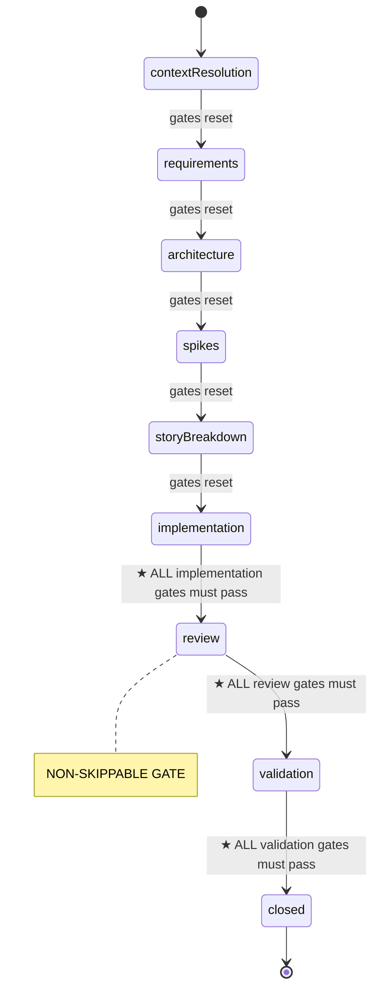

# Hard Gates

**Hard gates are non-skippable, structurally enforced checkpoints. They cannot be bypassed, deferred, or omitted. Failure to satisfy a hard gate before a phase transition is a failure condition that must be reported to the user.**

## Purpose

Prevent the agent from skipping critical quality and validation steps during workflow execution. Hard gates are tracked in `.cadet/state.json` under the `gates` object and are verified before every phase transition.

## Evidence backing (v2)

A gate may be `true` only when backed by a **fresh, structured evidence record** in `.cadet/state.json → gateEvidence`, bound to the current work item, input tree hash, and acceptance criteria. Evidence from a different work item, a changed input tree, changed criteria, an expired record, or a superseded record does not satisfy a gate. A hand-edited `true` gate with no evidence is rejected.

The CLI enforces this mechanically:

```bash
cadet-agent state validate                      # schema validation
cadet-agent state transition --to <phase>       # lists every missing/stale gate
cadet-agent harness verify --gate <gate>        # creates fresh evidence
```

See [Harness Contract](HarnessContract.md) for the frozen contract and `.cadet/agent/core/Harness.md` for the runtime rules.

## Index
- Docs index: [index](../index.md)

## Backlinks
- Identity reference: [Identity](Identity.md)
- Principles reference: [Principles](Principles.md)
- Workflow reference: [Workflow](Workflow.md)
- Operating rules reference: [OperatingRules](OperatingRules.md)
- Code review skill: [skills/CodeReview](skills/CodeReview.md)

---

## Gate System Overview



## Gate Definitions by Phase

The framework now expresses the checkpoints as XML structure in the core agent instructions, using `<gates>`, `<transition>`, and `<gate>` elements. The prose below preserves the same semantics for human readers.

### Implementation → Review Transition Gates

Before transitioning from `implementation` to `review`, ALL of the following gates must be explicitly satisfied:

| Gate | Requirement | How to Satisfy |
|------|-------------|----------------|
| `testsPassed` | All tests for the current story pass | Run `unity test <project>` (CLI; exit `6` = fail) or confirm user-run tests — see `core/UnityCli.md`. |
| `compileCheckConfirmed` | Unity project compiles without errors | Run `unity build`/`run`/`command eval` (CLI), or ask user to focus Unity and confirm 0 errors — see `core/UnityCli.md`. |
| `unityAnalyzerClean` | Zero Unity analyzer diagnostics in the changed files | Run the analyzer command declared in `.cadet/harness.json` — see `core/UnityCli.md`. |
| `storyTrackingUpdated` | Story markdown marked complete, epic progress updated | Update story file to `[x] done`, update epic tracker. |

> `testsPassed`, `compileCheckConfirmed` and `unityAnalyzerClean` are **agent-executable** via the Unity CLI. Use CLI commands for these deterministic checks (exit codes), and MCP mode for inspection/reasoning — see `core/UnityCli.md`.

**Transition rule:** If ANY of these four gates is `false`, do NOT advance to `review`. Fix the failing gate first.

### Review → Validation Transition Gates

Before transitioning from `review` to `validation`, the following gates must be satisfied — the last only when the repository opts into reachability:

| Gate | Requirement | How to Satisfy |
|------|-------------|----------------|
| `codeReviewCompleted` | Full 17-step review per [CodeReview](skills/CodeReview.md) completed | Execute all 17 review steps. File prioritized findings. |
| `securityReviewPassed` | No secrets, unsafe patterns, or security concerns | Explicitly check for credentials, tokens, keys, unsafe patterns. |
| `acceptanceCriteriaValidated` | Each Given/When/Then criterion validated | Walk through each AC, confirm it passes or document deviation. |
| `reachabilityAddressed` | The story's declared reachability is honoured: it is witnessed, or deferred to a work item that exists and is not already done | Run `cadet-agent harness verify-reachability --story <path>` **in this phase**. **Required only when** `.cadet/harness.json` sets `reachability.enabled`; an owned, unexpired deferral satisfies it, so infrastructure work is not blocked. |

**Transition rule:** If ANY required gate is `false`, do NOT advance to `validation`. Complete the review first.

### Validation → Closed Transition Gates

| Gate | Requirement | How to Satisfy |
|------|-------------|----------------|
| `designArtifactSyncConfirmed` | Requirements, design, project plan, and epics are mutually consistent | Cross-reference all planning artifacts. Update any stale docs. |

---

## Gate Execution Protocol

### Before Every Phase Transition

1. **Read current `gates` state** from `.cadet/state.json`.
2. **Check the transition requirements** for the target phase (see table above).
3. **If any required gate is `false`:**
   - State explicitly: "Gate X is not satisfied. I cannot advance to phase Y."
   - Execute the required action to satisfy the gate.
   - Set the gate to `true` in `.cadet/state.json`.
   - Re-check ALL gates before attempting transition again.
4. **Only when ALL required gates are `true`:** advance the phase.

### Gate Reset Rules

- All gates reset to `false` when entering a new phase (except `closed`).
- All gates reset to `false` when starting a new story within an epic.
- All gates reset to `false` when starting a new epic.

### Failure to Satisfy a Gate

If a gate cannot be satisfied (e.g., tests fail and cannot be fixed, design inconsistency cannot be resolved):

1. **Stop immediately.** Do not attempt to bypass the gate.
2. **Report to the user:** which gate failed, why, and what is needed to resolve it.
3. **Do not advance the phase** until the user provides a path to resolution.
4. If the user explicitly directs skipping a gate, record the exception in `changeHistory` with the user's rationale before advancing.

---

## Gate Visibility Rule

**Before every substantive action**, the agent must make the current gate state visible when it materially affects the next step. This means:

- After completing a story: show which gates are satisfied and which remain.
- Before asking to commit: confirm all relevant gates are `true`.
- When the user asks to move on: show the gate checklist and which gates block progress.

---

## Workflow Path Gate Variations

### Large Changes (epics + stories)

All gates apply. The review gate (`codeReviewCompleted`) is mandatory after EACH epic completion, not just at the end.

### Small Changes

| Gate | Applies? |
|------|----------|
| `testsPassed` | Yes (TDD red/green cycle) |
| `compileCheckConfirmed` | Yes |
| `codeReviewCompleted` | Yes (scoped review) |
| `securityReviewPassed` | Yes |
| `acceptanceCriteriaValidated` | If ACs were defined |
| `storyTrackingUpdated` | If story tracking is used |
| `designArtifactSyncConfirmed` | If design artifacts exist |
| `reachabilityAddressed` | If `reachability.enabled` is true (an owned deferral satisfies it) |

### No-Test-Required Changes

| Gate | Applies? |
|------|----------|
| `compileCheckConfirmed` | Yes |
| `codeReviewCompleted` | Yes (scoped review) |
| `securityReviewPassed` | Yes |
| Manual validation confirmed by user | Yes (replaces `testsPassed`) |
| `reachabilityAddressed` | If `reachability.enabled` is true — a doc or config change normally declares `witnessed` and needs no deferral |

---

## Anti-Patterns

- Advancing the phase when any required gate is `false`.
- Setting a gate to `true` without actually performing the required action.
- Skipping the review gate because "the change was small" — all changes require review, scoped appropriately.
- Treating gate checks as optional or "nice to have."
- Failing to update `.cadet/state.json` after satisfying a gate.
- Proceeding to the next story/epic without resetting gates.

---

## Integration with Operating Rules

Hard gates are an extension of [OperatingRules](OperatingRules.md). Violating a hard gate is a violation of operating rules and must be reported as a failure condition. The gate system provides the structural enforcement that prose rules alone cannot guarantee.
